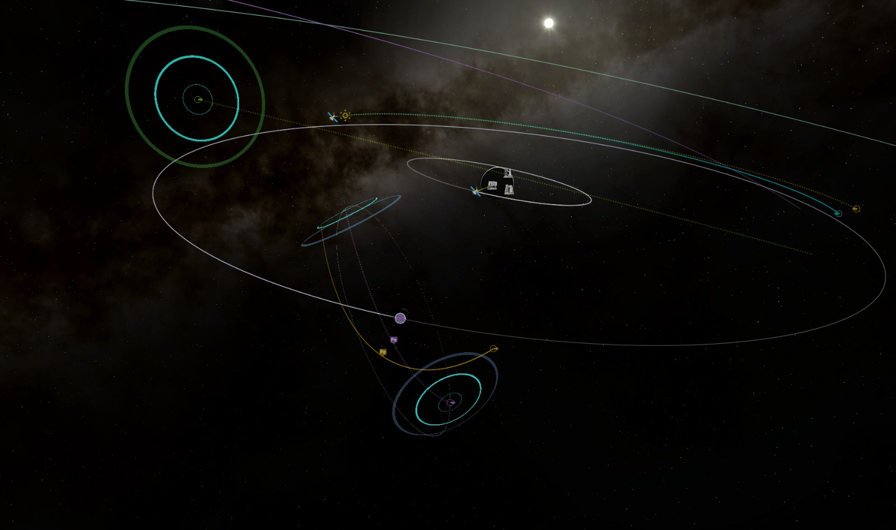

# OrbitInfluences

OrbitInfluences is a standalone visual mod for **Kerbal Space Program 1.12.5**. It shows a celestial body's sphere of influence (SOI) in the map and marks predicted SOI crossings with animated waves. It does not change trajectories or orbital mechanics.

## What it shows

- **Orbit Ring:** a thin SOI boundary aligned with the selected vessel's relevant orbital plane. If no vessel orbit applies, it uses the body's orbital plane or a stable reference plane.
- **Orbit Grid:** a spherical boundary with meridians and parallels fixed to the body. It does not rotate with the vessel's trajectory.
- **Transition waves:** expanding rings at predicted SOI entries and contracting rings at predicted exits. The rings follow the curved SOI surface. Planned maneuver trajectories can contribute crossings, including later transitions after an encounter.

The boundary radius comes from KSP's CelestialBody.sphereOfInfluence. Focusing a celestial body shows its boundary in Flight Map View or the Tracking Station. Waves require a vessel trajectory; select a vessel in the Tracking Station first. The mod retains that selection when KSP clears it during body focus.

## Install

1. Download OrbitInfluences-1.0.0.zip from the [releases page](https://github.com/Wid4er/KSP-OrbitInfluences/releases).
2. Extract its GameData/OrbitInfluences directory into the game's GameData directory. The DLL should end up at GameData/OrbitInfluences/Plugins/OrbitInfluences.dll.
3. Restart KSP and open Flight Map View or the Tracking Station.

No other mod is required. Do not install a second copy of OrbitInfluences alongside an existing symlink or directory.

## In-game settings

Click the OrbitInfluences ring icon in KSP's application launcher while the map or Tracking Station is open. The English panel lets you:

- Show or hide the SOI boundary, and choose **Orbit Ring** or **Orbit Grid**.
- Control boundary visibility for the current and future encounter trajectory, and adjust its color, opacity, and width.
- Show or hide entry and exit waves independently of the boundary.
- Include or exclude maneuver plans. With plans excluded, waves still follow the full unburned trajectory.
- Match the outer wave color to KSP's orbit segment, or choose a manual color. The default center color is #02FDFC.

The panel saves preferences between sessions in GameData/OrbitInfluences/Plugins/PluginData/OrbitInfluences/config.xml. GameData/OrbitInfluences/OrbitInfluences.cfg supplies defaults for a fresh installation and additional animation settings: rippleCount, rippleSpeed, rippleWidth, rippleAlpha, rippleMinScale, and rippleMaxScale. Restart KSP after editing the CFG. The personal PluginData file is not included in the release.

## Build from source

The build script compiles against the assemblies of an installed KSP 1.12.5 and needs a .NET SDK. Set KSP_ROOT if your installation is elsewhere, then run:

    sh tools/build.sh

It writes GameData/OrbitInfluences/Plugins/OrbitInfluences.dll. For the isolated trajectory and geometry checks, run:

    dotnet run --project tests/EncounterLookupTests.csproj

## Compatibility and limitations

The code uses KSP body data and does not require stock body names or an external mod. Kopernicus systems and unusual SOI scales have not been validated in game. The build and isolated tests pass, but the latest boundary and wave combinations still need a complete in-game visual check.

[OrbitPOInts](https://github.com/StrikeForceZero/KSP-OrbitPOInts) was consulted as a technical reference for KSP map coordinates and rendering. OrbitInfluences is independent and contains no copied OrbitPOInts source.

## License

OrbitInfluences is licensed under the [GNU General Public License version 3.0 only](LICENSE) (GPL-3.0-only).
